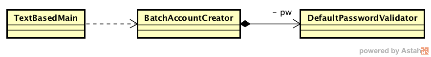

### Escuela Colombiana de Ingeniería
### Procesos de Desarrollo de Software - PDSW
### Parcial primer tercio

##### Nota: Se debe trabajar en Linux

__Nota:__ Durante el exámen se monitorearán todas las estaciones de trabajo. Tenga en cuenta:

* Se permite Consultar el cuaderno, enunciados de laboratorios, material de lectura dado en clase, APIs del lenguaje/frameworks.
* Implica anulación: Hacer uso de 'bancos de proyectos' en USB, Espacios de almacenamiento en la nube (Google Drive, OneDrive, Dropbox, etc), clientes de correo, redes sociales, etc, durante el exámen. 
* A la 1:00pm en punto se cierra el espacio de entrega. En ningún caso se ampliará el límite.


El siguiente, es el modelo de clases de una herramienta que realiza un proceso 'batch' (por lotes) para el registro de usuarios (y sus respectivas contraseñas) en una plataforma. La clase 'TextBasedMain' es el programa principal que inicia el proceso delegándolo a una instancia de la clase 'BatchAccountCreator'. Esta última tiene asociada un validador de contraseñas, usado durante el proceso para garantizar que sólo se registren los usuarios que tengan una contraseña que cumpla con los criterios de la plataforma.



Aunque la herramienta funciona bien, se ha encontrado que la misma sólo funciona con unos parámetros estándar de contraseñas, es decir, NO cumple con el principio Abierto/Cerrado en caso de querer adaptar su uso a una plataforma con políticas para contraseñas diferente.


1. Clone el proyecto con GIT (NO LO DESCARGUE!).

2. En una terminal, configure su usuario de GIT

	```bash
	$ git config --global user.name "Juan Perez"
	$ git config --global user.email juan.perez@escuelaing.edu.co
	```

3. Realice, en papel, el diagrama de clases (incluyendo los nombres de los métodos) para resolver el problema antes mencionado teniendo en cuenta:
	- El principio de inversión de dependencias.
	- Se espera, en el futuro, poder integrar nuevos esquemas de validación de contraseñas, y que actualmente se cuenta con uno alternativo: ISO3892PasswordValidator.
	- El patrón cracional Factory Method.

4. Realice, en papel, el mismo digrama, pero esta vez considerando que se usará un Contenedor Liviano, con soporte a la Inyección de Dependencias en lugar de patrones creacionales.

5. Implemente el diagrama realizado en el punto 2, haciendo uso -correcto- de Google Guice.

6. Teniendo en cuena la especificación del método de validación de contraseñas de la clase ISO3892PasswordValidator:

	```java	
	/**
	* Valida los criterios de la contraseña dada, retornando TRUE si cumple
	* con la norma (ficticia) ISO3892 que indica:
	* - Las contraseñas deben tener más de 10 caracteres, A MENOS que las mismas
	* tengan por lo menos uno de los siguientes caracteres especiales:  !@#$%ˆ
	* - En ningun caso las cotraseñas debe tener espacios
	* @param pwd la contrasena asociada
	* @return True si cumple con los criterios de la norma ISO3892
	*/	
	```
	
* Defina un conjunto de clases de equivalencia y condiciones de frontera asociadas, y documéntelas en la sección respectiva de los fuentes de la clase ISO3892PasswordValidator.
	
* Implemente una prueba por cada una de las anteriores clases, teniendo cuidado de que los mensajes de aserción indique claramente la naturaleza de la falla. El código de la clase a probar NO ES LEGIBLE, Y NO DEBE SER MODIFICADO. Para este ejercicio NO SE ESPERA QUE CORRIJA LOS DEFECTOS, sólo que los muestre.

## Entrega

Siga al pie de la letra estas indicaciones para la entrega de este punto. Hacer la entrega en un formato que NO SEA .ZIP, o sin la estructura abajo indicada, penalizará la nota en 0.5.


1. Deje configurada su aplicación para que haga uso del validador de contraseñas ISO3892.

2. Desde el directorio raíz (donde está este archivo README.md), haga add y commit de lo realizado hasta ahora.

	```bash
	$ git add .
	$ git commit -m "usando validador iso3890 - Juan Perez"
	```

3. Haga una rama 'cfg2' y ubíquese en la misma:

	```bash
	$ git branch cfg2
	$ git checkout cfg2
	```
	
4. Configure su aplicación para que ahora haga uso del validador de contraseñas Estándar.

5. Desde el directorio raíz (donde está este archivo README.md), haga add y commit de lo realizado hasta ahora.

	```bash
	$ git add .
	$ git commit -m "usando validador estándar - Juan Perez"
	```
6. Rectifique que en el proyecto hayan quedado las dos ramas. El siguiente comando:

	```bash
	$ git branch
	```
	
	debería mostrar:
	
	```bash
	*cfg2
	master
	```

7. Limpie el proyecto

	```bash
	$ mvn clean
	```

4. Desde este mismo directorio, comprima todo con: (no olvide el punto al final en la segunda instrucción)

	```bash
	$ zip -r APELLIDO.NOMBRE.zip .
	```
5. Abra el archivo ZIP creado, y rectifique que contenga lo desarrollado (incluyendo la carpeta .git).

6. Suba el archivo antes creado (APELLIDO.NOMBRE.zip) en el espacio de moodle correspondiente.

7. IMPORTANTE!. Conserve una copia de la carpeta y del archivo .ZIP.